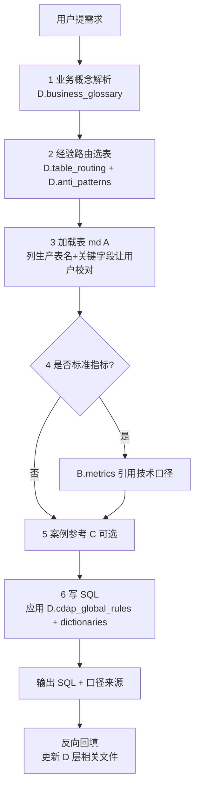

# /write-query — 编写优化的 CDAP Hive SQL

> 如果你看到不熟悉的占位符或需要查看已连接的工具，请参阅 [CONNECTORS.md](../../CONNECTORS.md)。

根据自然语言描述编写 Hive SQL，**优先用 D 层经验路由选对表**，再去 A 层加载字段，参考 B 层口径，借鉴 C 层案例。这是这套技能与"普通 SQL 助手"最大的区别。

## 知识资产分层（ABCD）

```
.claude/skills/write-query/references/
├── tables/        ← A 层 表结构（字段、分区、粒度）
├── metrics/       ← B 层 指标口径（业务+技术双口径 SQL）
├── demand-cases/  ← C 层 需求案例（编排，不新增口径）
└── D_experience/  ← D 层 经验/路由/全局规则/字典 ★关键差异化
```

| 层 | 回答的问题 | 入口 |
|----|---------|-----|
| **A** | 字段、分区、粒度是什么？ | [tables/{序号}_{表名}.md](references/tables/) + [TABLE_INDEX.md](references/TABLE_INDEX.md) |
| **B** | 标准指标怎么算？ | [metrics/INDEX.md](references/metrics/INDEX.md) + [metric_table_map.md](references/metric_table_map.md) + [metric_bridge.md](references/metric_bridge.md) |
| **C** | 类似需求别人怎么编排？ | [demand-cases/INDEX.md](references/demand-cases/INDEX.md) |
| **D** | 这个业务该去哪张表？有什么坑？硬规则是什么？码值多少？ | [D_experience/INDEX.md](references/D_experience/INDEX.md) |

**口径冲突优先级**：（1）B 层 metrics 技术口径 SQL（2）A 层表 md 「条件速查」（3）C 层案例只借结构 / 参数与 B 一致（4）D 层经验补充背景（5）自由推理须标"假设"并请用户确认。

---

## 启动加载清单（每次 /write-query 都要读）

> **小体积、必要、提供决策能力**——这 5 个文件常驻上下文，避免每次都漏。

| 文件 | 作用 |
|------|------|
| [references/KNOWLEDGE_LAYERS.md](references/KNOWLEDGE_LAYERS.md) | ABCD 四层总图 |
| [references/D_experience/INDEX.md](references/D_experience/INDEX.md) | D 层入口与回填规则 |
| [references/D_experience/business_glossary.md](references/D_experience/business_glossary.md) | 业务术语 ↔ CDAP 概念映射 |
| [references/D_experience/table_routing.md](references/D_experience/table_routing.md) | 业务场景 → 候选表（含反例） |
| [references/D_experience/anti_patterns.md](references/D_experience/anti_patterns.md) | 反 pattern 库 |
| [references/D_experience/cdap_global_rules.md](references/D_experience/cdap_global_rules.md) | CDAP 全局硬约束 |

**按需加载**（命中后再读）：
- A 层：`tables/{序号}_{表名}.md`（路由命中后）
- B 层：`metrics/{分类}/{metric_id}.md`（指标命中后）
- C 层：`demand-cases/Q-xxx_*.md`（场景相似时）
- D 层字典：`D_experience/dictionaries/{字段}.md`（写 WHERE 遇码值时）

---

## 工作流程（6 步）



### 第 1 步：业务概念解析（D 层主导）

把用户口语翻译成 CDAP 概念。

1. 读 [business_glossary.md](references/D_experience/business_glossary.md) 找匹配术语
2. **未命中术语必问用户**——不要猜（典型："你说的销售品是任意 offer 还是某个专项产品？"）
3. **澄清五项**（针对销售品/订单/动作类需求）：
   - 业务术语对应的 CDAP 概念
   - 客群范围（公众/商企/政企/小微/全部）
   - 时间口径（受理 act_date / 竣工 subs_stat_date / 开通 open_date / 分区 par_month_id）
   - 状态过滤（撤单作废排除？是否限定竣工？）
   - 动作过滤（订购/变更/退订/互换）
   - "是否X" 字段是过滤还是输出标记列？

> 默认尽量少问，但**关键歧义不要省**（参见 [AP-014](references/D_experience/anti_patterns.md)）。

### 第 2 步：经验路由选表（D 层主导）

1. 读 [table_routing.md](references/D_experience/table_routing.md) 按业务场景定位候选表
2. **同步检查 [anti_patterns.md](references/D_experience/anti_patterns.md)**：
   - 是否落入"字段名诱导选专项表"陷阱（[AP-001](references/D_experience/anti_patterns.md)）？
   - 用户要的是"任意 X"还是"专项 X"？
3. **选表三问**（在 [table_routing.md](references/D_experience/table_routing.md) 末尾）：
   - 业务范围：任意 vs 专项？
   - 动作 vs 存量？
   - 算数 vs 明细字段？
4. **若 D 层未路由到 → 退到老路径**：[TABLE_INDEX.md](references/TABLE_INDEX.md)（按主题）+ [metric_table_map.md](references/metric_table_map.md)（按指标）。**事后必须把这次的路由经验回填到 table_routing.md**。

### 第 3 步：加载 A 层表 md（强制校对）

1. 加载选定表的 md：`references/tables/{序号}_{表名}.md`
2. **必做：列出"我准备使用 X 库 Y 表"清单让用户校对**。原因：A 层 md 的 `hive_name` 与生产现网常有漂移（[R-004](references/D_experience/cdap_global_rules.md)、[AP-003](references/D_experience/anti_patterns.md)）
3. 检查 frontmatter 的 `partition_keys` 决定是否加分区裁剪（[R-008](references/D_experience/cdap_global_rules.md)、[AP-011](references/D_experience/anti_patterns.md)）
4. **A 层字段表是参考非完备清单**：md 没列的字段不代表表里没有，怀疑时问用户（[AP-002](references/D_experience/anti_patterns.md)）

### 第 4 步：指标对齐（B 层，可选）

1. 在 [metric_table_map.md](references/metric_table_map.md) 查指标名 → CDAP 流程
2. 在 [metric_bridge.md](references/metric_bridge.md) 把流程名映射到 `tables/` 文件
3. 在 [metrics/INDEX.md](references/metrics/INDEX.md) 找指标详情，复制**技术口径 SQL** 作为参考
4. 提示用户："已匹配指标 X / Y（来源：指标字典）。是否对齐？有遗漏吗？"

### 第 5 步：案例参考（C 层，可选）

在 [demand-cases/](references/demand-cases/) 查同场景案例，**只借 CTE / 分组结构**，条件以 B 层为准。

### 第 6 步：写 SQL（应用 D 层硬规则）

#### 6.1 强制硬规则清单（写完 SQL 自检）

每条规则违反必出错或漏数据，参见 [cdap_global_rules.md](references/D_experience/cdap_global_rules.md)：

- **R-001 维表加 city_id=200**：`dws_offer` / `dws_product` 等
- **R-002 撤单作废排除**：动作类统计加 `COALESCE(subs_stat_reason,'-1') NOT IN ('1200','1300')`
- **R-003 机构维表用 org_id + levs**：揽装分局 levs=3，营服 levs=4
- **R-004 表名以生产现网为准**：用户校对过的名是权威
- **R-005 "是否X" 默认输出标记列**：不进 WHERE 除非明确要求
- **R-006 状态/动作用码值不用术语**：未在 [dictionaries/](references/D_experience/dictionaries/) 找到 → 问用户
- **R-007 客户名取数路径**：041/022 直接 `cust_name` 不脱敏；069 是 `cust_name_tm` 脱敏
- **R-008 分区裁剪前看 partition_keys**：未标注不要加
- **R-009 明细 vs 汇总分清**：禁止行级窗口塞月汇总
- **R-010 时间字段语义对齐**：受理 / 竣工 / 开通各有专属字段

#### 6.2 SQL 通用最佳实践

**优先简单单 SELECT**：大多数查询单 SELECT 即可；仅在「需复用子查询/多维交叉/逻辑步骤多」时用 CTE。

**CASE WHEN 写法规则**：
- 统计**用户数** → `COUNT(CASE WHEN 条件 THEN serv_id END)`
- 统计**金额/积分** → `SUM(CASE WHEN 条件 THEN 字段 ELSE 0 END)`
- 不要用 `SUM(CASE WHEN 条件 THEN 1 ELSE 0 END)` 统计用户数，用 COUNT

**性能**：
- 生产 SQL 不用 `SELECT *`，只列需要的列
- 尽早 WHERE，分区字段放 WHERE 左侧
- 大子查询用 `EXISTS` 而非 `IN`
- 同 serv_id + 同业务键多笔订单用 `ROW_NUMBER` 窗口去重
- Hive 局部排序用 `SORT BY`，全局排序 `ORDER BY`（性能差）
- `UNION ALL` 优先于 `UNION`

**可读性**：
- 表别名取首字母缩写（不要只用 a/b/c）
- 每个主要子句单独占一行
- 注释解释"为什么"，不解释"是什么"

#### 6.3 输出格式

1. **完整可执行 SQL**（不留中文占位，参数用 `:placeholder` 或要用户填值后再交付）
2. **简要说明**：每段 CTE 作用 / 关键过滤
3. **口径来源标注**：每个核心指标注明来源（`B 层 metrics: M-xxx` / `A 层表速查` / `D 层经验` / `推理(待确认)`）
4. **性能说明**（如有）：分区使用、倾斜风险
5. **修改建议**（如有）：常见变化点

---

## 反向回填（每次任务完成后必做）

```
触发条件 → 必须更新的文件
─────────────────────────────────────────────────
用户口语术语未收录          → business_glossary.md 加 1 行
agent 第一次选错表          → table_routing.md 加正反两行
                            + anti_patterns.md 加 AP-NNN
状态/码值用术语被纠正        → dictionaries/{字段}.md 加 1 行
                            + 如典型，加 AP
表 md 与生产名漂移           → lessons_learned.md
                            + 修对应 A 层表 md frontmatter
发现新全局硬约束             → cdap_global_rules.md 加 R-NNN
踩坑无论大小                 → lessons_learned.md 五段式追加
```

不回填的代价：下次再踩一次同样的坑。回填越勤，agent 越准。

---

## 示例

**销售品类（典型）**：
```
/write-query 按给定的销售品取 202509、202510 月发展量，需要号码、客户名、揽装人、竣工时间、划小局向、揽装局向、销售品编码/名称
```
→ D.glossary：销售品=offer；竣工=subs_stat='301200' 标记列  
→ D.routing：销售品发展量 → 041 优惠订单表（不要选燃气卫士）  
→ D.global_rules：dws_offer 加 city_id=200；动作过滤 action_id IN (1292,6200)；排除撤单作废  
→ A.tables：041 + 020 + 075 + 069/dwm  
→ 输出：4 段 SQL（or 单 CTE）

**指标对齐类**：
```
/write-query 帮我看一下宽带入网，特别是 129+ 宽带的入网情况
```
→ B.metric_table_map：主宽入网数、129+ 宽带入网数  
→ A.tables：069 全业务资料表 + 条件速查  
→ 输出：单 SELECT + 指标口径来源标注

---

## 技巧

- **提供表名和分区字段** → 大幅提升查询效率
- **说明幂等性需求** → 是否参数化、是否覆盖写
- **数据量大** → 提示采样/分批
- **优先指标字典** → 避免口径不一致
- **用户给了正确生产代码** → 1:1 对齐生产口径，仅做明显 bug 修正并显式标注
